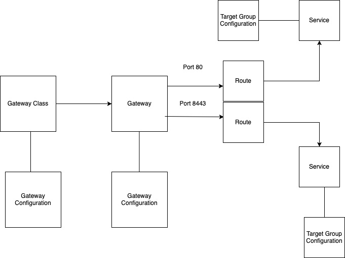

# Gateway API

    !!! warning
        - Only very basic (and not conforming) support of the Gateway API spec currently exists. The team is actively trying to close conformance and support gaps.
        - Using the LBC and Gateway API together is not suggested for production workloads (yet!)


The AWS Load Balancer Controller (LBC) supports reconciliation for Kubernetes Gateway API objects. It satisfies
L4 routes (TCPRoute, UDPRoute, TLSRoute) with an AWS NLB. It satisfies L7 routes (HTTPRoute, GRPCRoute) using an AWS ALB.
Mixing protocol layers, e.g. TCPRoute and HTTPRoute on the same Gateway, is not supported.

## Prerequisites
* LBC >= v2.13.0
* For `ip` target type:
    * Pods have native AWS VPC networking configured. For more information, see the [Amazon VPC CNI plugin](https://github.com/aws/amazon-vpc-cni-k8s#readme) documentation.
* Installation of Gateway API CRDs
  * Standard Gateway API CRDs: `kubectl apply -f https://github.com/kubernetes-sigs/gateway-api/releases/download/v1.2.0/standard-install.yaml` [REQUIRED]
  * Experimental Gateway API CRDs: `kubectl apply -f https://github.com/kubernetes-sigs/gateway-api/releases/download/v1.2.0/experimental-install.yaml` [OPTIONAL: Used for L4 Routes]
* Installation of LBC Gateway API CRDs:
  * `kubectl apply -f https://raw.githubusercontent.com/kubernetes-sigs/aws-load-balancer-controller/refs/heads/main/config/crd/gateway/gateway-crds.yaml`
## Configuration

By default, the LBC will _not_ listen to Gateway API CRDs. To enable support, specify the following feature flag(s) in the LBC deployment:

```
- --feature-gates=NLBGatewayAPI=true,ALBGatewayAPI=true
```

### Customization



The LBC tries to use sensible defaults. These defaults are not appropriate for each use-case.

#### Customizing the Gateway

For full details on what you can configure:
[LoadBalancerConfiguration CRD](./loadbalancerconfig.md)

For example, to configure your Gateway to provision an `internet-facing` LoadBalancer you can use this configuration:

```
apiVersion: gateway.k8s.aws/v1beta1
kind: LoadBalancerConfiguration
metadata:
  name: internet-facing-config
  namespace: echoserver
spec:
  scheme: internet-facing
```

You can then attach your configuration to either the Gateway or GatewayClass

Gateway
```
apiVersion: gateway.networking.k8s.io/v1
kind: Gateway
metadata:
  name: test-gw
  namespace: echoserver
spec:
  gatewayClassName: nlb-gateway
  infrastructure:
    parametersRef:
      group: gateway.k8s.aws
      kind: LoadBalancerConfiguration
      name: internet-facing-config # Must be in the same namespace as the Gateway
  listeners:
  ...
```

GatewayClass
```
apiVersion: gateway.networking.k8s.io/v1
kind: GatewayClass
metadata:
  name: nlb-gateway
spec:
  controllerName: gateway.k8s.aws/alb
  parametersRef:
    group: gateway.k8s.aws
    kind: LoadBalancerConfiguration
    name: internet-facing-config
    namespace: echoserver
```


#### Configuration Conflict Resolution

It is possible to attach a LoadBalancerConfiguration to both the Gateway and GatewayClass resources. When both the 
GatewayClass and Gateway LoadBalancerConfiguration specify the same field, the LBC uses a merging algorithm to take one value.
Priority of what value to take is determined by the `mergingMode` field, this field is used to give priority to either the 
GatewayClass or Gateway value. When the value is not set, the GatewayClass value takes higher precedence. The `mergingMode` field
is only read from the GatewayClass LoadBalancerConfiguration.

The following fields have differing merge behavior:

- `tags`: The two tags maps will be combined. Any duplicate tag keys will use the tag value from the higher priority config.
- `loadBalancerAttributes`: The two attribute lists will be combined. Any duplicate attribute keys will use the attribute value from the higher priority config.
- `mergeListenerConfig`: The two listener lists will be combined. Any duplicate ProtocolPort keys will use the listener config from the higher priority config.

#### Customizing the Targets

[Not currently supported]


## Protocols

    !!! warning
        - TLSRoute, GRPCRoute and HTTPS Listeners do not currently work.

The LBC Gateway API implementation supports all Gateway API routes:

L4 (NLB): UDPRoute, TCPRoute, TLSRoute
L7 (ALB): HTTPRoute, GRPCRoute 


## Subnet tagging requirements
See [Subnet Discovery](../../deploy/subnet_discovery.md) for details on configuring Elastic Load Balancing for public or private placement.

## Security group
- The AWS LBC creates and attaches frontend and backend security groups to Gateway by default. For more information, please see [the security groups documentation](../../deploy/security_groups.md)

!!! tip "disable worker node security group rule management"
You can disable the worker node security group rule management using the [LoadBalancerConfiguration CRD](./loadbalancerconfig.md).

### Worker node security groups selection
The controller automatically selects the worker node security groups that it modifies to allow inbound traffic using the following rules:

* For `instance` mode, the security group of each backend worker node's primary elastic network interface (ENI) is selected.
* For `ip` mode, the security group of each backend pod's ENI is selected.

!!! important "Multiple security groups on an ENI"

    If there are multiple security groups attached to an ENI, the controller expects only one security group tagged with following tags:

    | Key                                     | Value               |
    | --------------------------------------- | ------------------- |
    | `kubernetes.io/cluster/${cluster-name}` | `owned` or `shared` |

    `${cluster-name}` is the name of the Kubernetes cluster.

If it is possible for multiple security groups with the tag `kubernetes.io/cluster/${cluster-name}` to be on a target ENI, you may use the `--service-target-eni-security-group-tags` flag to specify additional tags that must also match in order for a security group to be used.